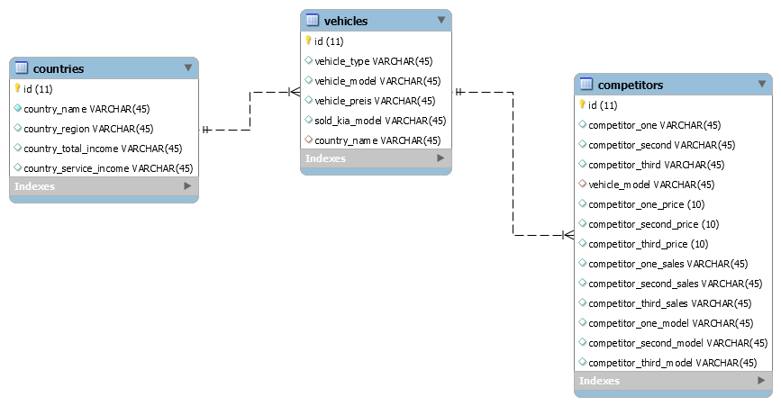

# kiabusinessresearch
Kia Test App 

My aim is just to show the fundamental process by combining frontend, backend, and database communication.

Youtube Link: Working Project  on Local Host
 https://www.youtube.com/watch?v=5Pezcnm82YM&feature=youtu.be

Source Website:
  - Bootstrap: Styling 
  - Express: Backend 
  - Node.js: 
  - EJS Web Template 
  - Images from car companies websites 

Sql Queries , 

router.get('/getcompetitors/:id', (req, res) => {
  var sql = 'SELECT * from competitors WHERE competitors.vehicle_model='+"'"+req.params.id+"'";
  db2.query(sql, (err, result) => {
      if(err) throw err;
      console.log(result);
      res.send(result);
  });
});

router.get('/createjoin', (req, res) => {
    var sql = "SELECT vehicles.vehicle_type, vehicles.vehicle_model,vehicles.sold_kia_model,countries.country_name FROM countries JOIN vehicles ON countries.country_name = vehicles.country_name ORDER BY vehicles.country_name";
    db2.query(sql, (err, result) => {
        if(err) throw err;
        console.log(result);
        res.send(result);
    });
});

!!!!!
I have combined the other first 3 brands and their models in the competitor table, normally creating a separate brand with the vehicle model table is a more accurate arrangement.

DATABASE STRUCTURE

